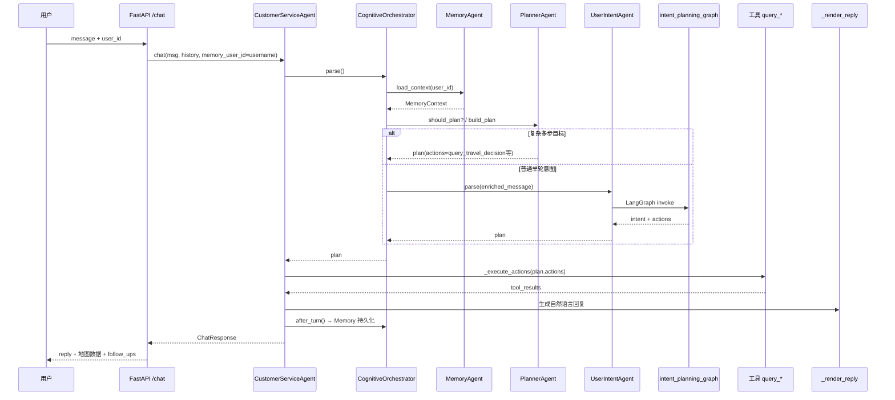

# Smart CS Agent — 系统架构与升级全记录

> 本文档描述 **当前完整架构**、**各层职责**、**历次升级清单** 与 **关键代码路径**。  
> 面向：接手开发、排查问题、继续扩展 Agent。

相关文档：

| 文档 | 内容 |
|---|---|
| [memory_planner_upgrade.md](./specs/memory_planner_upgrade.md) | Memory + Planner 专项设计 |
| [weather_gis.md](./specs/weather_gis.md) | 天气 GIS 行政区解析 |
| [../UPGRADE_SUMMARY.md](../UPGRADE_SUMMARY.md) | 升级速览（按时间线） |
| [../UPGRADES.md](../UPGRADES.md) | 扩展 Agent 接入示例 |

---

## 一、项目是什么

**智慧交通客服智能体（Smart CS Agent）** 是一个面向高速公路 / 出行咨询场景的对话系统。

它不是「多个大模型角色互相聊天」的演示型多智能体，而是：

- **编排式多智能体**：多个子 Agent 分工理解意图、生成工具计划
- **工具型主智能体**：`CustomerServiceAgent`（`main.py`）负责调工具、拼回复、展示地图/卡片
- **规则优先 + 可选 LLM**：大部分意图走规则与子 Agent；复杂句可让 DeepSeek（OpenAI 兼容 API）输出 JSON 计划

技术栈：**FastAPI · LangChain · LangGraph · MySQL · Vue 3 · BM25 RAG**

---

## 二、总体架构（当前版本）

```text
┌─────────────────────────────────────────────────────────────────────────┐
│  前端 Channel                                                            │
│  Vue 3（static-vue/） / 静态 HTML 兜底                                   │
│  登录 Cookie · 多轮对话 · 地图 Leaflet · 追问芯片                         │
└───────────────────────────────┬─────────────────────────────────────────┘
                                │ HTTP POST /chat
                                ▼
┌─────────────────────────────────────────────────────────────────────────┐
│  API 层（main.py FastAPI）                                               │
│  认证 AuthStore · 会话 ConversationStore · 埋点 tracking_integration      │
└───────────────────────────────┬─────────────────────────────────────────┘
                                ▼
┌─────────────────────────────────────────────────────────────────────────┐
│  主智能体 CustomerServiceAgent.chat()                                    │
│  ① cognitive.parse()  ② _execute_actions()  ③ _render_reply()          │
│  ④ cognitive.after_turn()  ⑤ follow_ups                                 │
└───────────────────────────────┬─────────────────────────────────────────┘
                                │
        ┌───────────────────────┼───────────────────────┐
        ▼                       ▼                       ▼
┌───────────────┐     ┌─────────────────┐     ┌─────────────────┐
│ Cognitive     │     │ 工具层           │     │ 知识 / 安全      │
│ Orchestrator  │     │ tools_infra/    │     │ RAG · safety/   │
│ memory/       │     │ 路径/天气/GIS   │     │                 │
│ planner/      │     │ 出行决策        │     │                 │
│ intent/       │     │                 │     │                 │
└───────────────┘     └─────────────────┘     └─────────────────┘
                                │
                                ▼
┌─────────────────────────────────────────────────────────────────────────┐
│  持久化                                                                  │
│  MySQL：用户/会话 · memory_* · weather_admin_*（GIS）                    │
│  JSON：conversations.json · memory_store.json（降级） · user_profiles   │
└─────────────────────────────────────────────────────────────────────────┘
```

### 单轮对话完整链路



---

## 三、认知层（2026-06 最新升级）

### 3.1 CognitiveOrchestrator

**文件**：`intent/cognitive_orchestrator.py`

**职责**：在既有 `UserIntentAgent` 之上增加「长期记忆 + 任务规划」，不修改各子 Agent 内部实现。

```python
# main.py 中的调用方式
plan = self.cognitive.parse(message, history, rag_hits, user_id=memory_user_id)
# ... 执行工具、渲染回复 ...
self.cognitive.after_turn(memory_user_id, message, plan, tool_results, reply=reply)
```

**开关**：`.env` 中 `COGNITIVE_ENABLE=true`（默认开）；未登录或无 `user_id` 时退回纯 `UserIntentAgent`。

### 3.2 Memory Agent（长期记忆）

**目录**：`memory/`

| 组件 | 文件 | 作用 |
|---|---|---|
| MemoryAgent | `agent.py` | 门面：加载/补全/抽取/保存 |
| MemoryRepository | `repository.py` | MySQL 三表读写，失败降级 JSON |
| MemoryToolkit | `tools.py` | Search / Save / Update / Delete |
| extractors | `extractors.py` | 规则抽取通勤、常住地、路线 |

**记忆分类**

| 类型 | 存储 | 示例 |
|---|---|---|
| Profile Memory | `memory_profile` 表 | `commute_origin=朝阳区`, `commute_dest=亦庄` |
| Episodic Memory | `memory_event` 表 | 某次路线查询、出行决策结果 |
| Conversation Memory | `memory_summary` 表 | 「讨论了北京到天津出行」 |

**典型行为**

```text
用户：我每天从朝阳区到亦庄上班
  → 写入 memory_profile（通勤起终点）

用户：今天几点出发
  → Memory 补全上下文
  → Planner 识别为出行决策
  → 自动 query_travel_decision(朝阳区, 亦庄)
```

**数据库**：`database/memory_schema.sql`

### 3.3 Planner Agent（任务规划）

**目录**：`planner/`

| 组件 | 文件 | 作用 |
|---|---|---|
| PlannerAgent | `agent.py` | 判断是否规划、生成 plan |
| rules | `rules.py` | 规则拆解（不依赖 LLM） |
| TaskExecutor | `executor.py` | Plan → 标准 `intent + actions` |
| planning_graph | `planning_graph.py` | LangGraph：memory_load → enrich → planner |

**Plan 结构**（`planner/models.py`）

```json
{
  "goal": "北京到天津出行决策",
  "tasks": [{"agent": "TravelDecisionAgent", "tool": "query_travel_decision", "params": {...}}],
  "execution": "mixed"
}
```

**触发规则（第一版）**

| 用户说法 | 生成动作 |
|---|---|
| 明天从 A 到 B 适合几点出发 | `query_travel_decision` |
| 未来三天适合去天津吗 | `query_weather`（含预报/AQI/预警） |
| 有通勤记忆 + 「今天几点出发」 | 自动补 OD → `query_travel_decision` |

**说明**：`query_travel_decision` 内部已串联 Route + Weather + AQI + GIS + Risk，Planner 的 `meta.decomposed_agents` 会展示逻辑子 Agent 视图。

**开关**：`PLANNER_ENABLE=true`

---

## 四、意图层（既有核心）

### 4.1 UserIntentAgent + LangGraph

**文件**：`intent/user_intent_agent.py`、`intent/intent_planning_graph.py`

**LangGraph 节点顺序**（单轮意图规划）：

```text
travel_decision_node
    ↓ 未命中
weather_node（WeatherAgent 多轮）
    ↓ 未命中
llm（DeepSeek 结构化 JSON 计划）
    ↓ 未命中
rules（IntentOrchestratorAgent 规则链）
    ↓
finalize → 返回 plan
```

### 4.2 IntentOrchestratorAgent（规则调度中枢）

**文件**：`intent/orchestrator_agent.py`

规则链顺序：

```text
1. RoadConditionAgent     — 显式高速编号
2. GeneralIntentAgent     — 天气规则
3. RoadConditionAgent     — 起终点+路况走廊
4. AgentRegistry          — 可插拔扩展 Agent（ETC/服务区/出发时间等）
5. RoutePlanningAgent     — 纯路径规划
6. RoadConditionAgent     — 历史路线高速、泛路况
7. GeneralIntentAgent     — 公交/票价/工单/转人工
```

### 4.3 子智能体清单

**主链路（自动参与规划）**

| Agent | 文件 | 职责 |
|---|---|---|
| TravelDecisionAgent | `travel_decision_agent.py` | OD+出发时间 → `query_travel_decision` |
| WeatherAgent | `weather_agent.py` | 天气多轮、途经城市、沿途逐站 |
| RoadConditionAgent | `road_condition_agent.py` | 高速路况 |
| RoutePlanningAgent | `route_planning_agent.py` | 路径规划 |
| GeneralIntentAgent | `general_intent_agent.py` | 公交/票价/工单/转人工 |

**扩展链（AgentRegistry，按 priority）**

| priority | Agent | 职责 |
|---:|---|---|
| 20 | ETCChargeAgent | ETC/过路费 |
| 30 | ServiceAreaAgent | 服务区/充电 |
| 32 | ParkingLotAgent | 停车场 |
| 35 | DepartureTimeAgent | 最佳出发时间 |
| 40 | TrafficIncidentAgent | 事故/管制 |
| 50 | WeatherImpactAgent | 天气对驾驶影响 |
| 60 | AccessibilityAgent | 无障碍出行 |
| 85 | ClarifyAgent | 低置信度追问 |

**按需调用（未强绑主流程）**

`GuardrailAgent` · `MultilingualAgent` · `FAQAgent` · `ProfileAgent`（JSON 画像，已被 Memory Agent 增强）· `ConversationSummarizer` · `ToolRouterAgent` · `SatisfactionAgent` · `EvalAgent`

---

## 五、工具层（tools_infra/）

主智能体通过 `plan.actions` 调用工具，核心工具：

| 工具名 | 实现位置 | 能力 |
|---|---|---|
| `query_route_plan` | `main.py` | 高德/OSRM 路径、折线、途经高速 |
| `query_weather` | `weather_tools.py` | 高德天气 / Open-Meteo、AQI、预警 |
| `query_highway_condition` | `main.py` | 高速拥堵/事故（内置+探测） |
| `query_travel_decision` | `main.py` + `travel_decision_tools.py` | 路线+天气+路况+风险综合 |
| `query_transit_status` | `main.py` | 公交地铁示例数据 |
| `calculate_fare` | `main.py` | 票价估算 |
| `create_transport_ticket` | `main.py` | 工单登记 |
| `handoff_to_human` | `main.py` | 转人工 |

**GIS 行政区解析**（2026-06 升级）

**文件**：`tools_infra/gis_location_tool.py`

解析顺序：

```text
1. MySQL weather_admin_boundary + weather_admin_alias（ST_Contains）
2. 本地 GeoJSON（GIS_ADMIN_BOUNDARY_GEOJSON）
3. 内置开发用 bbox
4. 高德 geocode 回退
```

示例：

```text
西青区天气 → alias 命中 → adcode=120111 → 高德天气
117.01,39.14天气 → ST_Contains → 西青区 → adcode → 高德天气
```

**数据库**：`database/weather_gis_schema.sql`  
**导入脚本**：`scripts/download_admin_boundaries.py`、`scripts/import_admin_boundaries.py`

**基础设施模块**

| 模块 | 文件 | 能力 |
|---|---|---|
| WeatherCache | `weather_cache.py` | TTL 缓存（Redis 或内存） |
| LocationParser | `location_parser.py` | 天气问句解析 |
| TTLCache / ToolRunner | `cache.py`, `registry.py` | 通用工具缓存与熔断 |

---

## 六、知识与安全层

| 模块 | 路径 | 说明 |
|---|---|---|
| RAG | `main.py` SimpleRAGStore + `rag/hybrid_retriever.py` | BM25 检索 knowledge_base.json；Hybrid 支持 RRF 融合 |
| Safety | `safety/pii.py`, `safety/moderation.py` | PII 脱敏、违禁扫描 |
| Guardrail | `intent/guardrail_agent.py` | 入站/出站安全 Agent |

---

## 七、数据与持久化

| 数据 | 位置 | 用途 |
|---|---|---|
| 用户/登录会话 | MySQL `users`, `user_sessions` | 注册登录 |
| 对话历史 | `data/conversations.json` | 按 scoped_id 存多轮 |
| 长期记忆 | MySQL `memory_profile/event/summary` | Memory Agent |
| 记忆降级 | `data/memory_store.json` | MySQL 不可用时 |
| 用户画像（旧） | `data/user_profiles.json` | ProfileAgent（与 Memory 并存） |
| GIS 边界 | MySQL `weather_admin_boundary` | 天气区域解析 |
| 知识库 | `data/knowledge_base.json` | RAG |
| 埋点 | `tracking_integration` | 可选 MySQL/CSV/JSONL |

---

## 八、升级时间线（全记录）

### 阶段 A — 基础多智能体（项目原始能力）

- FastAPI 客服主智能体 + 工具执行 + UGUI 前端
- `UserIntentAgent` 意图解析
- 路径 / 天气 / 路况 / 工单 / 转人工
- RAG（BM25）+ 多轮会话 JSON 存储
- MySQL 用户认证

### 阶段 B — LangGraph + 编排中枢（README「近期更新」）

| 升级项 | 关键文件 | 说明 |
|---|---|---|
| LangGraph 意图图 | `intent/intent_planning_graph.py` | TravelDecision → Weather → LLM → Rules |
| IntentOrchestratorAgent | `intent/orchestrator_agent.py` | 统一规则调度 |
| 子 Agent 拆分 | `road/route/general_intent_agent.py` | 路况/路径/通用分工 |
| 天气多轮增强 | `intent/weather_agent.py` | 途经城市、沿途逐站、裸查澄清 |
| 衣着建议 | `main.py _render_reply` | 天气成功后规则模板建议 |

### 阶段 C — 可插拔扩展（UPGRADES.md / UPGRADE_SUMMARY.md）

| 升级项 | 关键文件 | 说明 |
|---|---|---|
| AgentRegistry | `intent/agent_registry.py` | 扩展 Agent 协议 + priority |
| 7 个自动扩展 Agent | `etc/service/departure/traffic/weather_impact/accessibility/clarify` | 挂到 orchestrator 规则链 |
| 9 个按需 Agent | `guardrail/faq/profile/summarizer/...` | 留接入点 |
| tools_infra | `cache.py`, `registry.py` | TTL 缓存、ToolRunner |
| safety | `pii.py`, `moderation.py` | 安全工具库 |
| rag HybridRetriever | `rag/hybrid_retriever.py` | BM25 + 向量 RRF |
| evaluation | `evaluation/eval.py` | 离线意图回归 20 条 |

### 阶段 D — 出行决策 + GIS（2026-06）

| 升级项 | 关键文件 | 说明 |
|---|---|---|
| TravelDecisionAgent | `intent/travel_decision_agent.py` | OD+出发时间意图 |
| query_travel_decision | `main.py`, `travel_decision_tools.py` | 路线+天气+路况+风险一站式 |
| GIS MySQL 空间表 | `database/weather_gis_schema.sql` | 省市区边界 + alias |
| GISLocationTool | `tools_infra/gis_location_tool.py` | ST_Contains 坐标解析 |
| 边界数据导入 | `scripts/download_admin_boundaries.py` | 阿里云 DataV 下载 |
| | `scripts/import_admin_boundaries.py` | 导入 509 区县 |

### 阶段 E — Memory + Planner 认知层（2026-06 最新）

| 升级项 | 关键文件 | 说明 |
|---|---|---|
| Memory 三表 | `database/memory_schema.sql` | profile / event / summary |
| memory/ 模块 | `memory/*.py` | Repository + Tools + Agent |
| planner/ 模块 | `planner/*.py` | 规则规划 + LangGraph |
| CognitiveOrchestrator | `intent/cognitive_orchestrator.py` | 接入 main.chat() |
| 单测 | `tests/test_memory_*.py`, `test_planner_*.py`, `test_cognitive_*.py` | 7 条用例 |

**main.py 变更点**（相对阶段 C「不改 main」原则的演进）：

```python
self.cognitive = CognitiveOrchestrator(self)
plan = self.cognitive.parse(..., user_id=memory_user_id)
self.cognitive.after_turn(memory_user_id, ...)
```

---

## 九、环境变量一览

```env
# 大模型
DEEPSEEK_API_KEY / DEEPSEEK_BASE_URL / DEEPSEEK_MODEL_ID

# 高德（路径/天气/GIS geocode）
AMAP_API_KEY

# MySQL
MYSQL_HOST / MYSQL_USER / MYSQL_PASSWORD / MYSQL_DATABASE

# GIS 天气区域
GIS_ENABLE_MYSQL=true
GIS_BOUNDARY_TABLE=weather_admin_boundary
GIS_ALIAS_TABLE=weather_admin_alias
GIS_ADMIN_BOUNDARY_GEOJSON=...

# Memory + Planner（认知层）
MEMORY_ENABLE_MYSQL=true
MEMORY_JSON_FALLBACK=data/memory_store.json
PLANNER_ENABLE=true
COGNITIVE_ENABLE=true
```

---

## 十、如何扩展（不破坏现有架构）

### 新增一个业务 Agent

1. 在 `intent/` 新建 `xxx_agent.py`，实现 `name` / `priority` / `try_plan()`
2. 注册到 `agent_registry.default_extension_factories()`
3. 返回 plan 时复用既有 `IntentType`，通过 `actions` 承载工具调用

### 新增一种 Memory 类型

1. 在 `memory/extractors.py` 增加抽取规则
2. 在 `MemoryAgent.extract_and_save()` 写入 `memory_profile` 或 `memory_event`

### 新增 Planner 场景

1. 在 `planner/rules.py` 的 `should_plan()` / `build_plan()` 增加模式
2. 映射到已有 `tool`（优先复用 `query_travel_decision` / `query_weather`）

### 预留但未实现的 Agent

| Agent | 扩展点 |
|---|---|
| RecommendationAgent | `MemoryContext.proactive_hint` |
| NotificationAgent | 天气事件 + 通勤 profile 触发 |
| EmergencyAgent | `TrafficIncidentAgent` + 推送通道 |
| ScheduleAgent | `DepartureTimeAgent` + Memory 日历 |

---

## 十一、本地启动与验证

```bash
# 后端
cd smart-cs-agent
source .venv/bin/activate
uvicorn main:app --reload --port 8010

# 可选：GIS + Memory 建表
mysql -u root -p smart_cs_agent < database/weather_gis_schema.sql
mysql -u root -p smart_cs_agent < database/memory_schema.sql
```

**建议验证话术**

| 话术 | 验证能力 |
|---|---|
| 上海到北京怎么走 | 路径规划 |
| 西青区天气 | GIS alias + 天气 |
| 我每天从朝阳区到亦庄上班 | Memory 通勤 |
| 今天几点出发 | Memory + Planner |
| 明天从北京到天津适合几点出发 | Planner + TravelDecision |
| 未来三天适合去天津吗 | Planner + 天气/AQI |

---

*文档版本：2026-06-14 · 覆盖至 Memory + Planner + GIS 升级*
