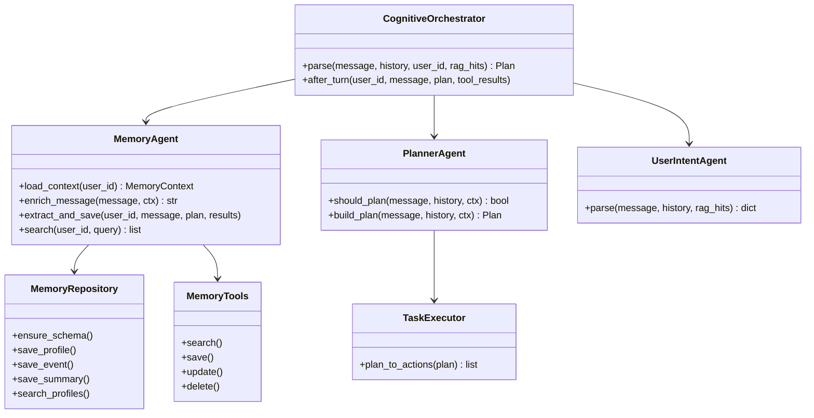
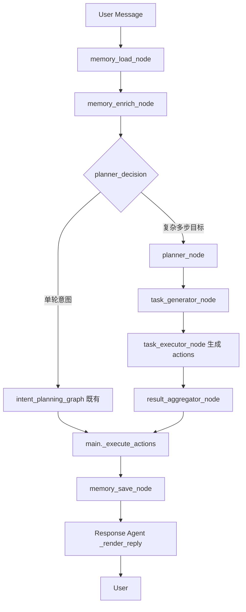

# Memory Agent + Planner Agent 升级设计

> 在现有智慧交通多智能体平台上新增长期记忆与任务规划能力，兼容现有 LangGraph 与子 Agent。

---

## 1. 目录结构

```text
smart-cs-agent/
├── docs/specs/
│   └── memory_planner_upgrade.md      # 本文档
├── database/
│   ├── weather_gis_schema.sql
│   └── memory_schema.sql              # 记忆三表 DDL
├── memory/
│   ├── __init__.py
│   ├── models.py                      # Profile/Event/Summary 数据模型
│   ├── repository.py                  # MySQL 读写 + JSON 降级
│   ├── extractors.py                  # 规则抽取（通勤/偏好/事件）
│   ├── tools.py                       # MemorySearch/Save/Update/Delete
│   └── agent.py                       # MemoryAgent 门面
├── planner/
│   ├── __init__.py
│   ├── models.py                      # Plan / PlanTask
│   ├── rules.py                       # 规则型任务拆解
│   ├── executor.py                    # 多 Agent 动作生成
│   ├── agent.py                       # PlannerAgent
│   └── planning_graph.py              # LangGraph 规划图
├── intent/
│   ├── cognitive_orchestrator.py        # Memory → Planner → Intent 编排
│   └── intent_planning_graph.py         # 既有（不变）
└── tests/
    ├── test_memory_agent.py
    ├── test_planner_agent.py
    └── test_cognitive_orchestrator.py
```

---

## 2. Agent 设计图



---

## 3. LangGraph 流程图



**与现有图的关系**

- `intent_planning_graph`（TravelDecision → Weather → LLM → Rules）**保持不变**
- 新图 `planning_graph` 在其**上游**决定是否走 Planner 多任务分支
- `CognitiveOrchestrator` 编译并调用两层图

---

## 4. 数据库设计

### memory_profile（长期画像）

| 字段 | 类型 | 说明 |
|---|---|---|
| id | BIGINT PK AI | |
| user_id | VARCHAR(64) | 登录用户名 |
| key | VARCHAR(64) | 如 `commute_origin`, `commute_dest`, `pref_mode` |
| value | TEXT | JSON 或文本 |
| created_at | DATETIME | |
| updated_at | DATETIME | |

唯一索引：`(user_id, key)`

### memory_event（事件记忆）

| 字段 | 类型 | 说明 |
|---|---|---|
| id | BIGINT PK AI | |
| user_id | VARCHAR(64) | |
| event_type | VARCHAR(32) | `commute`, `route_query`, `weather_query`, `travel_decision` |
| content | JSON | 结构化事件 |
| created_at | DATETIME | |

索引：`(user_id, event_type, created_at)`

### memory_summary（会话摘要）

| 字段 | 类型 | 说明 |
|---|---|---|
| id | BIGINT PK AI | |
| user_id | VARCHAR(64) | |
| summary | TEXT | 滚动摘要 |
| created_at | DATETIME | |

---

## 5. Memory 设计

### 记忆分类

| 类型 | 存储 | 示例 |
|---|---|---|
| Profile Memory | `memory_profile` | 住朝阳区；每天开车上班；常查天气 |
| Conversation Memory | `memory_summary` + 会话 history | 本轮讨论北京→天津路线 |
| Episodic Memory | `memory_event` | 2026-06-15 推荐 09:00 出发 |

### Memory Agent 流程

```text
用户发言 → 加载 profile/event/summary
        → enrich_message（补全通勤 OD）
        → 规划/回答后 extract_and_save
        → 判断是否值得记忆 → 写入 DB
```

### Memory Tools

- `MemorySearchTool` — 按 key/关键词检索 profile + event
- `MemorySaveTool` — 新增 profile 或 event
- `MemoryUpdateTool` — 更新 profile value
- `MemoryDeleteTool` — 删除指定记忆

---

## 6. Planner 设计

### Plan 结构

```json
{
  "goal": "北京到天津出行决策",
  "tasks": [
    {"id": "t1", "agent": "RouteAgent", "tool": "query_route_plan", "parallel_group": 1},
    {"id": "t2", "agent": "WeatherAgent", "tool": "query_weather", "parallel_group": 2},
    {"id": "t3", "agent": "AQIAgent", "tool": "query_weather", "parallel_group": 2},
    {"id": "t4", "agent": "RiskAgent", "tool": "query_travel_decision", "parallel_group": 3}
  ],
  "execution": "mixed"
}
```

### 触发规则（第一版规则引擎，不依赖 LLM）

| 用户意图模式 | 生成任务 |
|---|---|
| OD + 几点出发/适合 | Route → Weather(起终点) → AQI → TravelDecision |
| 未来N天适合去X吗 | Weather(X) → AQI(X) → 风险建议 |
| 周末X日游 | Weather → Route(多点) → Parking |
| 通勤 + 今天几点出发 | 用 Memory 补 OD → DepartureTime |

### 执行模式

- **串行**：有依赖的任务（Route 结果供 Weather 途经城市）
- **并行**：同 `parallel_group` 的 Weather + AQI
- **混合**：先 Route，再并行 Weather/AQI，最后 Risk 汇总

### 容错

- Agent/工具失败 → 重试 1 次 → 使用缓存 → 降级单 Agent → 友好提示

---

## 7. 主动推荐（预留）

```text
Memory 发现每日「朝阳区→亦庄」通勤
  → Planner 监听天气事件
  → 明日暴雨 → 生成主动提醒「建议提前 30 分钟出发」
```

第一版：在 `memory_save` 后检测 `commute` profile，于回复末尾追加 **proactive_hint** 字段（规则模板）。

---

## 8. 实施阶段

| 阶段 | 内容 | 状态 |
|:---:|---|:---:|
| 0 | 设计文档 | ✅ |
| 1 | memory_schema + Repository + Tools | 进行中 |
| 2 | MemoryAgent + 规则抽取 | 待做 |
| 3 | PlannerAgent + planning_graph | 待做 |
| 4 | CognitiveOrchestrator 接入 main | 待做 |
| 5 | 测试 | 待做 |

---

## 9. 环境变量

```env
MEMORY_ENABLE_MYSQL=true
MEMORY_JSON_FALLBACK=data/memory_store.json
PLANNER_ENABLE=true
PLANNER_USE_LLM=false
```
